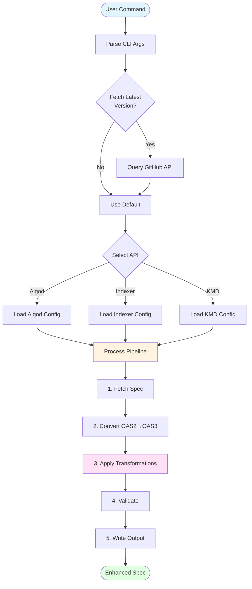
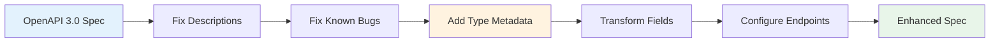

# Algorand OpenAPI Converter

A standalone tool for converting Algorand API specifications from OpenAPI 2.0 (Swagger) to OpenAPI 3.0 with Algorand-specific transformations and enhancements.

This converter fetches the latest OpenAPI specifications from the official Algorand repositories (go-algorand and indexer) and produces clean, validated OpenAPI 3.0 specifications ready for code generation in any language.

## Features

- **Automatic Fetching**: Downloads latest specs directly from Algorand GitHub repositories
- **Format Conversion**: Converts Swagger 2.0 → OpenAPI 3.0 using swagger-converter
- **Algorand Extensions**: Adds vendor extensions for Algorand-specific types:
  - `x-algokit-bigint`: Marks 64-bit integer fields
  - `x-algokit-signed-txn`: Identifies SignedTransaction fields
  - `x-algokit-bytes-base64`: Marks base64-encoded binary data
- **Validation & Fixes**: Automatically fixes known issues in source specs
- **Msgpack Support**: Marks endpoints and fields that use msgpack encoding
- **Field Transformations**: Applies required field corrections and naming fixes

## Prerequisites

- [Node.js 18+](https://nodejs.org/) - JavaScript runtime
- [npm](https://www.npmjs.com/) - Package manager (included with Node.js)

## Setup

```bash
# Install dependencies
npm install
```

## Usage

### Convert All Specs

Convert all three Algorand API specifications (Algod, Indexer, KMD):

```bash
npm run convert-openapi
```

### Convert Individual Specs

Convert specific API specifications:

```bash
# Convert only Algod spec
npm run convert-algod

# Convert only Indexer spec
npm run convert-indexer

# Convert only KMD spec
npm run convert-kmd
```

### Output

The converted OpenAPI 3.0 specifications will be written to:

- `specs/algod.oas3.json` - Algod API specification
- `specs/indexer.oas3.json` - Indexer API specification
- `specs/kmd.oas3.json` - KMD API specification

## How It Works

The converter processes API specifications through a five-stage pipeline:



**Process Overview:**

1. **Fetch**: Downloads the latest specification from Algorand's GitHub repository
2. **Convert**: Transforms Swagger 2.0 to OpenAPI 3.0 format using swagger-converter
3. **Transform**: Applies Algorand-specific enhancements (vendor extensions, field fixes, etc.)
4. **Validate**: Ensures the output is a valid OpenAPI 3.0 specification
5. **Output**: Writes the enhanced specification to the `specs/` directory

## Source Specifications

### Algod

- **Source**: [go-algorand](https://github.com/algorand/go-algorand/blob/master/daemon/algod/api/algod.oas2.json)
- **Format**: OpenAPI 2.0 (Swagger)
- **Description**: Algorand node daemon API for interacting with the blockchain

### Indexer

- **Source**: [indexer](https://github.com/algorand/indexer/blob/master/api/indexer.oas2.json)
- **Format**: OpenAPI 2.0 (Swagger)
- **Description**: Algorand Indexer API for blockchain data queries

### KMD

- **Source**: [go-algorand](https://github.com/algorand/go-algorand/blob/master/daemon/kmd/api/swagger.json)
- **Format**: Swagger 2.0
- **Description**: Key Management Daemon API for managing signing keys

## Algorand-Specific Transformations

The converter applies several transformations to make the specs more suitable for code generation. Transformations are applied sequentially in the following order:



### 1. Vendor Extensions

**BigInt Fields** (`x-algokit-bigint: true`)
- Marks fields that require 64-bit integer precision
- Applied to: `format: "uint64"`, `x-algorand-format: "uint64"`, `x-go-type: "uint64"`
- Examples: `amount`, `round`, `total-apps-opted-in`

**Signed Transactions** (`x-algokit-signed-txn: true`)
- Identifies SignedTransaction types
- Applied to: `x-algorand-format: "SignedTransaction"`
- Enables proper msgpack serialization

**Base64 Bytes** (`x-algokit-bytes-base64: true`)
- Marks binary data encoded as base64 strings
- Examples: `private_key` in KMD

### 2. Field Corrections

**Required Fields**
- Removes incorrect required fields that are actually optional
- Example: `approval-program` and `clear-state-program` in `ApplicationParams`

**Field Constraints**
- Adds proper min/max values
- Example: `num-uint` and `num-byte-slice` (0-64 range)

### 3. Msgpack Endpoint Marking

**Msgpack-Only Endpoints** (Algod)
- Endpoints that only accept/return msgpack:
  - `POST /v2/transactions` - Raw transaction submission
  - `GET /v2/transactions/pending/{txid}` - Pending transaction info
  - `GET /v2/blocks/{round}` - Block retrieval

**JSON-Only Endpoints** (Algod)
- Forces JSON for specific endpoints:
  - `GET /v2/accounts/{address}` - Account information
  - `GET /v2/accounts/{address}/assets/{asset-id}` - Asset holdings

### 4. Bug Fixes

- **Missing Descriptions**: Adds required description fields for responses
- **Pydantic Recursion**: Fixes circular reference issues
- **KMD Prefixes**: Removes redundant `APIVn` prefixes from schema names

## Using in Language Repositories

This standalone converter is designed to be consumed by language-specific repositories for code generation.

### As a Git Submodule

```bash
# In your language repo (e.g., algokit-core, algokit-utils-py)
git submodule add <repo-url> api-specs

# Update specs
cd api-specs
npm install
npm run convert-openapi

# Reference specs in your generators
./api-specs/specs/algod.oas3.json
```

### Direct Integration

Copy the generated specs to your project:

```bash
# From this repo
npm run convert-openapi

# Copy to your project
cp specs/*.oas3.json /path/to/your/project/specs/
```

## Development

### Running Tests

```bash
npm test
```

### Linting

```bash
npm run lint
```

### Formatting

```bash
npm run format
```

## Version Tracking

The converter fetches specs from the latest stable release tags:
- **Algod/KMD**: Latest stable tag from `go-algorand` (format: `v3.x.x-stable`)
- **Indexer**: Latest tag from `indexer` repository

Generated specs include metadata about their source version in console output.

## Advanced Configuration

The conversion process is configured in `main.ts` with separate `ProcessingConfig` objects for each API. To customize transformations, edit the configuration objects in the source file.

### Configuration Options

- `sourceUrl`: GitHub raw URL for the source spec
- `outputPath`: Where to write the converted spec
- `vendorExtensionTransforms`: Vendor extension rules to apply
- `requiredFieldTransforms`: Required field corrections
- `fieldTransforms`: Field-level transformations
- `msgpackOnlyEndpoints`: Endpoints that use msgpack exclusively
- `jsonOnlyEndpoints`: Endpoints that use JSON exclusively
- `stripKmdApiVersionPrefixes`: Remove KMD API version prefixes (KMD only)

## Troubleshooting

### Rate Limiting

If you encounter GitHub API rate limits:
- Wait for the rate limit to reset
- Use authenticated requests (set `GITHUB_TOKEN` environment variable)
- Use cached specs if available

### Conversion Failures

If conversion fails:
- Check network connectivity
- Verify the source URLs are accessible
- Ensure Node.js and npm are up to date
- Check console output for specific error messages

## CI/CD Automation

This repository includes automated workflows for maintaining and releasing OpenAPI specifications.

### Weekly Sync Workflow

**File**: `.github/workflows/openapi_sync.yml`

Runs every Monday at 9:00 AM UTC to detect upstream changes in Algorand's API specifications.

**What it does**:
- Fetches latest specs from go-algorand and indexer repositories
- Converts them using the same process as `npm run convert-openapi`
- Compares generated files with committed versions
- Fails if differences are detected (indicating upstream changes)

**When it fails**:
1. Run `npm run convert-openapi` locally
2. Review the changes with `git diff`
3. Commit and push the updated specs

**Manual trigger**:
```bash
# Via GitHub Actions UI: Actions > OpenAPI Sync > Run workflow
```

### Release Workflow

**File**: `.github/workflows/openapi_release.yml`

Creates GitHub releases with converted OpenAPI 3.0 specifications as downloadable assets.

**What it does**:
- Converts all three API specs (algod, indexer, kmd)
- Creates a GitHub release with the specs as attachments
- Includes metadata about source versions in release notes

**Trigger methods**:

1. **Push a git tag**:
```bash
git tag v1.0.0
git push origin v1.0.0
```

2. **Manual workflow dispatch**:
```bash
# Via GitHub Actions UI: Actions > OpenAPI Release > Run workflow
# Enter tag name: v1.0.0
```

**Using released specs**:
```bash
# Download from releases
curl -LO https://github.com/YOUR_ORG/algokit-configs/releases/download/v1.0.0/algod.oas3.json

# Use with any OpenAPI code generator
openapi-generator generate -i algod.oas3.json -g python -o ./client
```

## Why OpenAPI 3.0?

OpenAPI 3.0 is preferred over Swagger 2.0 for several reasons:

- **Enhanced Schema Features**: Better support for complex types and validation
- **Component Reusability**: Improved `$ref` resolution and schema composition
- **Better Type Definitions**: More precise type specifications
- **Wider Tool Support**: Better compatibility with modern code generators
- **Vendor Extensions**: Better support for custom metadata

## Contributing

Contributions are welcome! Please ensure:

1. New transformations are well-documented
2. Changes maintain backward compatibility with existing generators
3. Test your changes with all three API specs
4. Update this README with any new features or configuration options

## License

MIT

## Related Projects

- [algokit-core](https://github.com/algorandfoundation/algokit-core) - Rust and TypeScript implementations
- [algokit-utils-py](https://github.com/algorandfoundation/algokit-utils-py) - Python implementation
- [go-algorand](https://github.com/algorand/go-algorand) - Source of Algod and KMD specs
- [indexer](https://github.com/algorand/indexer) - Source of Indexer spec